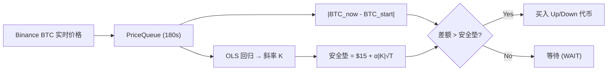

# SimplePolyBot 全面深度审计诊断报告

> **审计日期**: 2026-04-02  
> **审计范围**: 全部源代码 (~7000+ 行) — 4 个核心模块 + shared 公共层 + 配置体系 + 策略研究文档  
> **审计维度**: 代码层 (架构 / 安全 / 可靠性 / 性能) + 交易策略层 (逻辑 / 风控 / 盈利性)

---

## 一、策略设计意图概述

根据 [Polymarket 交易策略.md](file:///d:/SimplePolyBot/Polymarket%20交易策略.md) 和 [Polymarket 交易研究报告.md](file:///d:/SimplePolyBot/Polymarket%20交易研究报告.md) 的完整阐述，本系统的策略核心并非传统的"方向性预测"，而是一种**基于时间衰减的动量突破狙击策略**：

1. 在 5 分钟周期的**前 200 秒**（T-300 ~ T-100），系统只做数据积累——从 Binance WS 高频采集 BTC 价格并填充 180 秒滚动队列
2. 在**T-100 至 T-10 秒的狙击窗口**，每秒计算一次 OLS 回归斜率 K，并判断：
   - `|Current BTC Price - Start BTC Price|` 是否击穿 `Base Cushion ($15) + Buffer Cushion (α × |K| × √TimeRemaining)`
   - 若击穿，说明 BTC 价格已在一个方向上形成了足够的偏离，剩余时间内反转概率极低
3. 触发买入后，根据偏离方向选择 Polymarket 合约中的 **Up 或 Down 代币**，以 FAK 订单执行



> [!IMPORTANT]
> 以下审计的所有判断基于上述策略意图。我将逐一分析代码实现与策略设计之间的差距。

---

## 二、交易策略层审计

### 2.1 安全垫模型：设计 vs 实现

#### 策略文档的设计

| 参数 | 设计值 | 物理含义 |
|------|--------|---------|
| Base Cushion | **$15**（BTC 价差） | 过滤 BTC 5 分钟内 < $15 的微弱波动噪音 |
| α | 风险敏感度参数 | 控制 Buffer 对波动的响应强度 |
| K | OLS 斜率（BTC$/秒） | 反映 180 秒内 BTC 价格变化速率 |
| Buffer Cushion | `α × |K| × √TimeRemaining` | 距离结算越远 → 垫越厚 → 要求越大的偏移量 |
| 比较公式 | `|BTC_now - BTC_start| > $15 + Buffer` | 差额和安全垫都在 **BTC 价格美元空间** |

#### 代码的实际实现

[settings.yaml](file:///d:/SimplePolyBot/config/settings.yaml):
```yaml
strategy:
  base_cushion: 0.05   # ← 0.05 而非 $15
  alpha: 0.7
```

[safety_cushion.py:L69](file:///d:/SimplePolyBot/modules/strategy_engine/safety_cushion.py#L69):
```python
self.base_cushion = base_cushion if base_cushion is not None else strategy_config.base_cushion
# 实际值 = 0.05
```

**🔴 严重问题 #1：Base Cushion 值与策略设计不匹配** (★★★★★)

设计文档明确定义 Base Cushion 为 **$15**（BTC 价格空间），但 [settings.yaml](file:///d:/SimplePolyBot/config/settings.yaml) 中设置为 `0.05`。0.05 在 BTC 价格空间中几乎等于零（$0.05），意味着任何微小波动都会击穿安全垫，导致信号频繁误触发。

> [!CAUTION]
> 如果 `0.05` 是有意设计（即在概率空间 0-1 内），则说明策略代码的比较逻辑与策略文档的设计逻辑在**量纲上不一致**——策略文档在 BTC 美元空间比较，代码却在 Polymarket 概率空间比较。两种解释均说明存在严重偏差。

**我的建议**：明确定义安全垫的量纲。如果策略确实在 BTC 美元空间比较差额（`|BTC_now - BTC_start|`），则 Base Cushion 应设为 15.0；如果策略已转向概率空间，则整个安全垫公式需要重新校准。

---

#### 安全垫公式中 [calculate_max_buy_price](file:///d:/SimplePolyBot/modules/strategy_engine/signal_generator.py#319-339) 的量纲混淆

[safety_cushion.py:L166-L194](file:///d:/SimplePolyBot/modules/strategy_engine/safety_cushion.py#L166-L194):
```python
def calculate_max_buy_price(self, current_price, safety_cushion):
    max_buy_price = current_price - safety_cushion
    max_buy_price = max(0.01, min(0.99, max_buy_price))
```

[signal_generator.py:L160-L162](file:///d:/SimplePolyBot/modules/strategy_engine/signal_generator.py#L160-L162):
```python
max_buy_price = self.calculate_max_buy_price(
    current_price, safety_cushion_result.total_cushion
)
```

**🔴 严重问题 #2：[calculate_max_buy_price](file:///d:/SimplePolyBot/modules/strategy_engine/signal_generator.py#319-339) 把 BTC 价格当作合约价格** (★★★★★)

这里 `current_price` 传入的是 **BTC 的美元价格**（如 $67,000），然后减去安全垫后 `clamp` 到 `[0.01, 0.99]`。无论安全垫是多少，`$67000 - anything` 都远大于 0.99，所以 [max_buy_price](file:///d:/SimplePolyBot/modules/order_executor/fee_calculator.py#203-242) 会**永远被钳位到 0.99**。

**我的判断**：这个函数混淆了两个价格空间：
- `current_price`：BTC 美元价格（~$60,000-100,000）
- [max_buy_price](file:///d:/SimplePolyBot/modules/order_executor/fee_calculator.py#203-242)：Polymarket 合约价格（0.01-0.99）

策略文档中的"最大买入价格"指的是 Polymarket 合约的最大买入价（$0.75 ~ $0.90），应该根据**剩余时间查表**获取（T-90 → $0.75, T-50 → $0.85, T-10 → $0.90），而不是从 BTC 价格减去安全垫。

---

### 2.2 信号生成逻辑

#### [determine_action](file:///d:/SimplePolyBot/modules/strategy_engine/signal_generator.py#243-306) — 触发条件分析

[signal_generator.py:L243-L305](file:///d:/SimplePolyBot/modules/strategy_engine/signal_generator.py#L243-L305):

```python
def determine_action(self, price_difference, time_remaining, r_squared, confidence, max_buy_price):
    if not self.is_in_time_window(time_remaining):  # T-100 ~ T-10 ✅
        return SignalAction.WAIT
    if price_difference < self.min_price_difference:  # 0.01 — 见下文分析
        return SignalAction.WAIT
    if r_squared < self.min_r_squared:  # 0.5 ✅
        return SignalAction.WAIT
    if confidence < self.min_confidence:  # 0.6 ✅
        return SignalAction.WAIT
    if max_buy_price > self.get_max_buy_price_limit(confidence):  # 见问题 #2
        return SignalAction.WAIT
    return SignalAction.BUY
```

**🟡 问题 #3：[price_difference](file:///d:/SimplePolyBot/modules/strategy_engine/signal_generator.py#200-225) 的比较缺少安全垫判断** (★★★★☆)

策略文档的核心触发条件是：
```
|Current Price - Start Price| > Base Cushion + Buffer Cushion
```

但代码中 [determine_action](file:///d:/SimplePolyBot/modules/strategy_engine/signal_generator.py#243-306) 只检查 `price_difference < 0.01`（极小的硬编码阈值），**完全没有与安全垫比较**。安全垫被计算了（`safety_cushion_result.total_cushion`），但仅用于 [calculate_max_buy_price](file:///d:/SimplePolyBot/modules/strategy_engine/signal_generator.py#319-339)（问题 #2 已说明该函数逻辑不正确）。

**我的判断**：策略的核心判断逻辑——"差额击穿安全垫" ——在代码中没有被正确实现。应该改为：

```python
if price_difference < safety_cushion_result.total_cushion:
    return SignalAction.WAIT  # 差额未击穿安全垫
```

---

#### 置信度计算的归一化系数

[signal_generator.py:L376-L390](file:///d:/SimplePolyBot/modules/strategy_engine/signal_generator.py#L376-L390):

```python
normalized_slope = min(abs_slope * 1000, 1.0)
normalized_difference = min(price_difference * 10, 1.0)
```

**🟡 问题 #4：归一化系数未校准** (★★★☆☆)

- `abs_slope` 是 BTC 价格对时间的回归斜率，典型值在 0.001 ~ 10 $/s 范围。乘以 1000 后：
  - K = 0.01 $/s → normalized = 10.0 → clamped 到 1.0（已饱和）
  - K = 0.001 $/s → normalized = 1.0（也饱和了）
  
- [price_difference](file:///d:/SimplePolyBot/modules/strategy_engine/signal_generator.py#200-225) 是 BTC 价格差额，典型值 $1 ~ $100。乘以 10 后全部立即饱和到 1.0

**我的判断**：当前归一化系数会导致置信度在绝大多数情况下≈1.0，失去区分能力。建议基于历史 BTC 5 分钟数据统计合理的归一化范围。

---

### 2.3 信号到执行的链路

#### 两套不同的 [TradingSignal](file:///d:/SimplePolyBot/modules/strategy_engine/signal_generator.py#34-75) 定义

**🔴 严重问题 #5：策略引擎与订单执行器的信号数据结构不兼容** (★★★★★)

| 字段 | 策略引擎 ([signal_generator.py:L34](file:///d:/SimplePolyBot/modules/strategy_engine/signal_generator.py#L34)) | 订单执行器 ([redis_subscriber.py:L22](file:///d:/SimplePolyBot/modules/order_executor/redis_subscriber.py#L22)) |
|------|------|------|
| [action](file:///d:/SimplePolyBot/modules/strategy_engine/signal_generator.py#243-306) | ✅ `BUY/WAIT/HOLD` | ❌ 不存在 |
| [direction](file:///d:/SimplePolyBot/modules/strategy_engine/signal_generator.py#226-242) | ✅ `UP/DOWN` | ❌ 不存在 |
| `signal_id` | ❌ 不存在 | ✅ 必需 |
| `token_id` | ❌ 不存在 | ✅ 必需（验证必通过） |
| `market_id` | ❌ 不存在 | ✅ 必需 |
| `side` | ❌ 不存在 | ✅ `BUY/SELL` 必需 |
| [size](file:///d:/SimplePolyBot/modules/strategy_engine/price_queue.py#201-210) | ❌ 不存在 | ✅ 必需（> 0） |
| [strategy](file:///d:/SimplePolyBot/shared/config.py#338-355) | ❌ 不存在 | ✅ 必需 |

策略引擎发布一个包含 [action](file:///d:/SimplePolyBot/modules/strategy_engine/signal_generator.py#243-306), [direction](file:///d:/SimplePolyBot/modules/strategy_engine/signal_generator.py#226-242), `current_price`, [start_price](file:///d:/SimplePolyBot/modules/strategy_engine/market_lifecycle.py#204-215) 的信号，但订单执行器期望接收 `signal_id`, `token_id`, `market_id`, `side`, [size](file:///d:/SimplePolyBot/modules/strategy_engine/price_queue.py#201-210), [strategy](file:///d:/SimplePolyBot/shared/config.py#338-355) 等完全不同的字段。`RedisSubscriber.from_dict()` 会使用默认值填充缺失字段，但 [validate()](file:///d:/SimplePolyBot/modules/order_executor/redis_subscriber.py#112-152) 会因为 `token_id` 为空而返回 `False`，信号被静默丢弃。

**我的判断**：策略→执行的核心链路是**断裂**的。这两个模块目前无法协同工作。

---

#### 缺失的市场发现环节

**🔴 严重问题 #6：策略引擎不知道该买哪个 Polymarket 合约** (★★★★★)

策略引擎的完整输出是："BTC 在上涨/下跌，价差已击穿安全垫，应该买入"。但它不包含：
- 当前活跃的 5 分钟市场的 [condition_id](file:///d:/SimplePolyBot/modules/settlement_worker/ctf_contract.py#370-401) 或 `token_id`
- Up 代币和 Down 代币分别对应哪个 `token_id`
- 该市场的 Polymarket 挂单价格

策略文档明确提到需要通过**预计算 Slug**（`btc-updown-5m-{window_start_timestamp}`）来确定市场，但代码中没有实现这一步。

---

### 2.4 最大买入价格的阶梯式控制

#### 策略文档的时间阶梯设计

| 剩余时间 | 最大买入价格 | 逻辑 |
|---------|------------|------|
| T-90s | $0.75 | 风险大，要求低价买入 |
| T-50s | $0.85 | 确定性增加 |
| T-10s | $0.90 | 几乎确定，放宽 |

#### 代码实现

[signal_generator.py:L340-L355](file:///d:/SimplePolyBot/modules/strategy_engine/signal_generator.py#L340-L355):

```python
def get_max_buy_price_limit(self, confidence):
    if confidence >= 0.8:
        return self.max_buy_prices.get("high_confidence", 0.98)
    elif confidence >= 0.6:
        return self.max_buy_prices.get("default", 0.95)
    else:
        return self.max_buy_prices.get("fast_market", 0.90)
```

**🟡 问题 #7：最大买入价格由置信度而非剩余时间决定** (★★★★☆)

策略文档明确要求最大买入价格应**基于剩余时间 [time_remaining](file:///d:/SimplePolyBot/modules/strategy_engine/market_lifecycle.py#166-184) 查表**，利用时间衰减来控制风险。但代码中改为基于置信度（[confidence](file:///d:/SimplePolyBot/modules/strategy_engine/signal_generator.py#357-391)）分档。由于问题 #4 中置信度趋近饱和，这会导致系统几乎总是使用最宽松的价格限制（$0.98），失去了策略文档中精心设计的时间阶梯风控。

**建议**：应按照策略文档改为时间驱动：

```python
def get_max_buy_price_limit(self, time_remaining: float) -> float:
    if time_remaining > 80:
        return 0.75
    elif time_remaining > 40:
        return 0.85
    else:
        return 0.90
```

---

### 2.5 方向判断与代币选择

**策略文档说明**：
- `Current Price > Start Price` → BTC 涨 → 买 **Up** 代币
- `Current Price < Start Price` → BTC 跌 → 买 **Down** 代币

**代码实现**：

[signal_generator.py:L226-L241](file:///d:/SimplePolyBot/modules/strategy_engine/signal_generator.py#L226-L241):
```python
def determine_direction(self, price_difference):
    if price_difference > 0:
        return SignalDirection.UP
    elif price_difference < 0:
        return SignalDirection.DOWN
```

✅ **方向判断逻辑正确**。策略引擎确实能正确输出 UP/DOWN 方向。

但如问题 #5 所述，[direction](file:///d:/SimplePolyBot/modules/strategy_engine/signal_generator.py#226-242) 字段虽然被正确计算，却**无法传递给订单执行器**。即使传递了，订单执行器也不知道 UP/DOWN 各自对应的 `token_id`。

---

## 三、代码层审计

### 3.1 架构设计

**判断：模块化分层合理，Redis Pub/Sub 解耦设计正确，但接口契约未统一。**

#### ✅ 优点
- 分层清晰：数据采集 → 策略分析 → 订单执行 → 结算
- Redis Pub/Sub 松耦合，模块可独立部署
- 各模块内部代码质量高：类型标注完整、Docstring 齐全、命名规范

#### 🔴 核心接口问题

已在策略层审计的问题 #5 中详述。两个模块定义了同名但结构完全不同的 [TradingSignal](file:///d:/SimplePolyBot/modules/strategy_engine/signal_generator.py#34-75) 类，是架构层面缺少统一的**接口契约层**（应放入 `shared/` 中）。

---

### 3.2 周期管理与数据一致性

**🔴 问题 #8：周期切换时价格队列未清空** (★★★★★)

[strategy_engine/main.py:L184-L234](file:///d:/SimplePolyBot/modules/strategy_engine/main.py#L184-L234):

当 `MarketLifecycleManager.get_current_cycle()` 检测到新周期开始（`MarketPhase.INITIALIZING`），代码设置新的 [start_price](file:///d:/SimplePolyBot/modules/strategy_engine/market_lifecycle.py#204-215) 但**不清空 [PriceQueue](file:///d:/SimplePolyBot/modules/strategy_engine/price_queue.py#38-297)**。这意味着：
- OLS 回归使用跨周期的旧数据
- [start_price](file:///d:/SimplePolyBot/modules/strategy_engine/market_lifecycle.py#204-215) 取 [get_earliest_price()](file:///d:/SimplePolyBot/modules/strategy_engine/price_queue.py#167-178) 可能是上一周期的价格
- 安全垫计算基于错误的斜率

**建议**：检测到 `cycle_id` 变化时立即调用 `self.price_queue.clear()`。

---

### 3.3 线程安全

**🟡 问题 #9：消息缓冲区无锁保护** (★★★★☆)

[_message_buffer](file:///d:/SimplePolyBot/modules/strategy_engine/main.py#304-314) 是普通 Python List，在 Redis 回调线程中 `append`，在主循环线程中 [clear](file:///d:/SimplePolyBot/modules/strategy_engine/price_queue.py#195-200)，无任何同步机制。

**🟡 问题 #10：大批量消息并行处理破坏时序** (★★★☆☆)

`ThreadPoolExecutor(max_workers=4)` 并行调用 `PriceQueue.push()`，可能导致价格入队顺序与实际时间戳不符。对 OLS 回归而言，数据时序正确性是基本前提。

---

### 3.4 安全性

**总体评价：基本到位。**

| 项目 | 评价 |
|------|------|
| 私钥管理 | ✅ 通过 `.env` 加载，日志中自动脱敏 |
| API 凭证 | ✅ 环境变量管理，无硬编码 |
| 日志安全 | ✅ 敏感信息正则过滤 |
| CLOB 凭证验证 | ⚠️ `create_or_derive_api_creds` 返回值未校验 |

---

### 3.5 风控体系

**🔴 问题 #11：`risk_management` 参数加载但从未使用** (★★★★★)

[order_manager.py:L122](file:///d:/SimplePolyBot/modules/order_executor/order_manager.py#L122):
```python
self.risk_management = strategy_config.risk_management
```

搜遍整个 [OrderManager](file:///d:/SimplePolyBot/modules/order_executor/order_manager.py#90-744)，**`self.risk_management` 在后续方法中从未被引用**。以下配置全部不生效：

```yaml
risk_management:
  max_position_size: 5000     # ❌ 未检查
  max_total_exposure: 20000   # ❌ 未检查
  max_daily_loss: 500         # ❌ 未检查
  max_drawdown: 0.15          # ❌ 未检查
  min_balance: 100            # ❌ 未检查
```

**🔴 问题 #12：止损/止盈未实现** (★★★★★)

```yaml
stop_loss_take_profit:
  enabled: true
  stop_loss_percentage: 0.10
  take_profit_percentage: 0.20
```

无任何模块读取或使用这些配置。

**🔴 问题 #13：交易结果无反馈闭环** (★★★★☆)

`order_executor` 将结果发布到 `TRADE_RESULT_CHANNEL`，但无模块订阅；策略引擎不知道当前持仓状态，可能重复下单。

---

### 3.6 可靠性

| 项目 | 状态 | 说明 |
|------|------|------|
| Binance WS 重连 | ✅ | 指数退避重连 |
| Redis 订阅者重连 | ⚠️ | 执行器有重连但策略引擎循环缺乏 |
| 断路器 | ✅ | CLOB API 调用保护 |
| 优雅关闭 | ✅ | 信号处理完整 |

### 3.7 性能

| 项目 | 表现 | 评价 |
|------|------|------|
| OLS 回归 | < 10ms (180 点) | ✅ 满足 1 秒周期 |
| PriceQueue push | 0.04ms | ✅ 极佳 |
| 信号生成 | < 1ms | ✅ 极佳 |
| 端到端延迟 | ~0.7ms | ✅ 满足需求 |

---

## 四、问题优先级排序

### P0 — 必须在实盘前修复

| # | 问题 | 影响 | 修复方向 |
|---|------|------|---------|
| 5 | 两套 [TradingSignal](file:///d:/SimplePolyBot/modules/strategy_engine/signal_generator.py#34-75) 不兼容 | 信号链路完全断裂 | 统一定义放入 `shared/models.py` |
| 6 | 缺少市场发现模块 | 不知道买哪个合约 | 集成 Gamma API，预计算 Slug 获取 `token_id` |
| 1 | Base Cushion 值不匹配 | 安全垫形同虚设 | 对齐策略文档或重新校准 |
| 2 | [max_buy_price](file:///d:/SimplePolyBot/modules/order_executor/fee_calculator.py#203-242) 量纲混淆 | 永远钳位到 0.99 | 分离 BTC 价差比较与合约价格控制 |
| 3 | 差额未与安全垫比较 | 核心触发条件缺失 | 在 [determine_action](file:///d:/SimplePolyBot/modules/strategy_engine/signal_generator.py#243-306) 中添加安全垫比较 |
| 11 | 风控参数未使用 | 无持仓/亏损限制 | 在 [OrderManager](file:///d:/SimplePolyBot/modules/order_executor/order_manager.py#90-744) 中实现检查 |

### P1 — 核心功能完善

| # | 问题 | 修复方向 |
|---|------|---------|
| 7 | 买入价格应按时间而非置信度 | 改为 [time_remaining](file:///d:/SimplePolyBot/modules/strategy_engine/market_lifecycle.py#166-184) 查表 |
| 8 | 周期切换不清队列 | 周期变化时 `price_queue.clear()` |
| 12 | 止损/止盈未实现 | 增加持仓监控模块 |
| 13 | 交易结果无反馈 | 策略引擎订阅 `TRADE_RESULT_CHANNEL` |

### P2 — 优化加固

| # | 问题 | 修复方向 |
|---|------|---------|
| 4 | 置信度归一化饱和 | 基于历史数据校准系数 |
| 9 | 消息缓冲区无锁 | 替换为 `queue.Queue` |
| 10 | 并行处理破坏时序 | 移除 ThreadPoolExecutor |

---

## 五、综合评分

| 维度 | 评分 (1-10) | 说明 |
|------|------------|------|
| 代码风格一致性 | **9** | 命名规范、类型标注完整、Docstring 齐全 |
| 模块化设计 | **8** | 分层合理、依赖注入、接口清晰 |
| 错误处理 | **7** | 自定义异常、重试机制完善 |
| 安全性 | **7** | 私钥/凭证管理到位 |
| 策略逻辑与设计一致性 | **3** | 安全垫量纲、触发条件、价格控制均与设计文档存在偏差 |
| 模块间集成度 | **2** | 信号数据结构不统一，核心链路断裂 |
| 风控有效性 | **2** | 参数定义完整但执行层缺失 |
| **生产就绪度** | **2** | 需修复 P0 问题后方可考虑实盘 |
